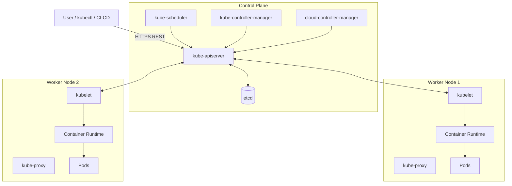
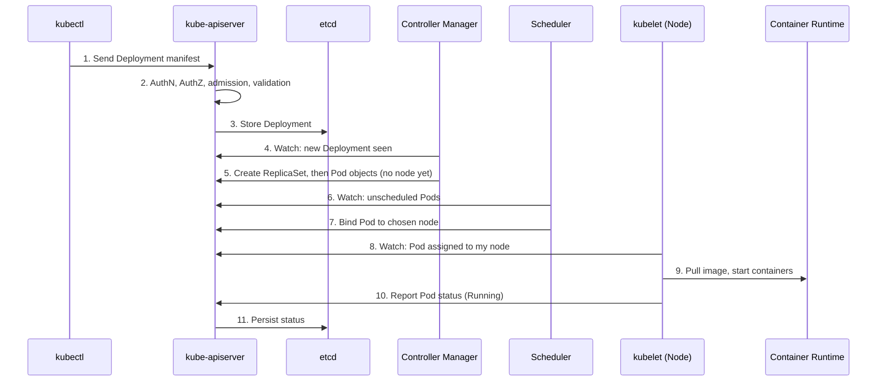

# Kubernetes: Bring-up Options and Components

## 1. K8s Bring-up Options

| Where it runs | Options | Typical use |
|---|---|---|
| Laptop / Desktop | `kind`, `k3s` (written as `k3c` in notes) | Development and learning |
| Physical / Virtual Machines | `kubeadm`, `kubespray` | Self-managed clusters (on-prem, VMs in cloud) |
| Managed K8s (on cloud) | AKS, EKS, GKE | Production without managing the control plane |
| Playground | Killercoda | Browser-based practice, no install |

### 1.1 Laptop / Desktop (for dev purposes)

- **kind** (Kubernetes IN Docker): runs each cluster node as a Docker container. Fast to create and destroy, supports multi-node clusters on one machine. Needs Docker installed.
- **k3s** (lightweight Kubernetes by Rancher): single small binary, low memory footprint, good for laptops, edge and IoT. (Notes say `k3c`; the well-known lightweight distribution is `k3s`.)

### 1.2 Physical / Virtual Machines

- **kubeadm**: the official tool to bootstrap a cluster. You prepare the machines (container runtime, kubelet, kubeadm, kubectl), run `kubeadm init` on the control plane and `kubeadm join` on workers. You choose and install the CNI network plugin yourself.
- **kubespray**: Ansible-based installer. Takes an inventory of machines and builds a production-grade cluster (uses kubeadm underneath). Good for repeatable, multi-node, HA setups.

### 1.3 Managed Kubernetes (K8s on cloud)

The cloud provider runs and upgrades the control plane; you manage worker nodes (or use serverless nodes) and workloads.

- **Azure Kubernetes Service (AKS)**
- **Elastic Kubernetes Service (EKS)** on AWS
- **Google Kubernetes Engine (GKE)**

### 1.4 Kubernetes Playground

- **Killercoda**: free browser-based interactive environments with ready clusters and scenarios. Nothing to install.

---

## 2. Kubernetes Architecture Overview

A Kubernetes cluster has two parts:

1. **Control Plane** (master): the brain. Makes decisions and stores cluster state.
2. **Worker Nodes**: the muscle. Run your application containers.



Same picture in plain text:

```
                        +-----------------------------------------------+
   kubectl / CI-CD ---> |               CONTROL PLANE                   |
                        |                                               |
                        |  +---------------+      +-------+             |
                        |  | kube-apiserver| <--> | etcd  |             |
                        |  +-------+-------+      +-------+             |
                        |      ^   ^   ^                                |
                        |      |   |   +--- cloud-controller-manager    |
                        |      |   +------- kube-controller-manager     |
                        |      +----------- kube-scheduler              |
                        +------+----------------------------------------+
                               |
              +----------------+-----------------+
              |                                  |
   +----------v-----------+          +-----------v----------+
   |   WORKER NODE 1      |          |   WORKER NODE 2      |
   | kubelet  kube-proxy  |          | kubelet  kube-proxy  |
   | container runtime    |          | container runtime    |
   | [Pod] [Pod] [Pod]    |          | [Pod] [Pod]          |
   +----------------------+          +----------------------+
```

---
## Master Node components
API Server: This is responsible for communication
etcd: This is where the data is stored (memory of k8s cluster)
scheduler: This is responsible for creating any new container (pod)
controller: This is not one component but internally many components.
cloud controller manager (optional): This exists on k8s hosted by cloud providers (AKS, GKE, EKS): This is aware of cloud specifics.

## Node Components
Kubelet: This is agent of k8s master. This recieves instructions and executes them
Container Runtime: This is container engine.
Kube-proxy: This is responsible for communication (part of networking)
Refer Here and Refer Here

---

## 3. Control Plane Components

### 3.1 kube-apiserver

- The **front door** of the cluster. Every request (from `kubectl`, controllers, kubelets, scheduler) goes through it.
- Exposes the Kubernetes REST API over HTTPS.
- Handles **authentication**, **authorization** (RBAC) and **admission control**, then validates and persists objects.
- The only component that talks directly to etcd.
- Stateless, so you can run multiple replicas behind a load balancer for HA.

### 3.2 etcd

- Distributed, consistent **key-value store** holding all cluster state: nodes, pods, secrets, configmaps, services and so on.
cxf- If etcd is lost, the cluster state is lost, so **back it up regularly** (`etcdctl snapshot save`).
- Uses the Raft consensus algorithm; run an odd number of members (3 or 5) for HA.

### 3.3 kube-scheduler

- Watches for newly created Pods that have **no node assigned**.
- Picks the best node in two phases:
  1. **Filtering**: remove nodes that cannot run the pod (not enough CPU/memory, taints, node selectors, affinity rules).
  2. **Scoring**: rank the remaining nodes and choose the highest.
- It only **decides**; it writes the chosen node name into the Pod via the API server. The kubelet does the actual starting.

### 3.4 kube-controller-manager

Runs many **controllers** in one process. Each controller runs a loop: *observe current state, compare to desired state, act to reconcile*.

| Controller | Job |
|---|---|
| Node controller | Notices and reacts when nodes go down |
| ReplicaSet / Deployment controller | Keeps the desired number of pod replicas running |
| Job controller | Runs pods to completion for one-off tasks |
| EndpointSlice controller | Links Services to Pods |
| ServiceAccount / Token controller | Creates default accounts and tokens for namespaces |

### 3.5 cloud-controller-manager

- Present when running on a cloud (AKS, EKS, GKE, or self-managed on cloud).
- Connects Kubernetes to the cloud provider API: creates **load balancers** for `Service type=LoadBalancer`, manages **routes**, and checks whether a node still exists in the cloud.
- Not present in local setups like kind.

---

## 4. Worker Node Components

### 4.1 kubelet

- The **node agent**. Registers the node with the API server.
- Watches for Pods assigned to its node, then tells the container runtime to start them.
- Runs **liveness, readiness and startup probes**, restarts failed containers, and reports pod and node status back to the API server.

### 4.2 Container Runtime

- Software that actually **pulls images and runs containers**.
- Must implement the **CRI** (Container Runtime Interface). Common choices: **containerd**, **CRI-O**.
- Docker Engine itself is no longer used directly (dockershim was removed in v1.24); Docker-built images still work fine because they follow the OCI standard.

### 4.3 kube-proxy

- Runs on every node and implements **Service networking**.
- Programs `iptables` or `IPVS` rules so traffic sent to a Service's virtual IP is load-balanced across the backing Pods.

---

## 5. Add-ons and Networking

| Add-on | Purpose |
|---|---|
| **CNI plugin** (Calico, Flannel, Cilium, Weave) | Gives Pods IPs and lets Pods on different nodes talk to each other. Not installed by default with kubeadm. |
| **CoreDNS** | Cluster DNS. Lets you reach a Service by name, e.g. `my-svc.my-namespace.svc.cluster.local`. |
| **Ingress controller** (NGINX, Traefik) | HTTP/HTTPS routing from outside the cluster to Services. |
| **Metrics Server** | Resource metrics for `kubectl top` and the Horizontal Pod Autoscaler. |
| **Dashboard** | Optional web UI. |

---

## 6. Key Objects You Will Meet

| Object | What it is |
|---|---|
| **Pod** | Smallest deployable unit; one or more containers sharing network and storage |
| **ReplicaSet** | Keeps N identical pods running |
| **Deployment** | Manages ReplicaSets; rolling updates and rollbacks |
| **Service** | Stable IP/DNS name and load balancing for a set of pods |
| **Namespace** | Logical partition of the cluster |
| **ConfigMap / Secret** | Configuration and sensitive data for pods |
| **PersistentVolume / PVC** | Storage that outlives pods |

---

## 7. What Happens When You Run `kubectl apply -f deployment.yaml`



Step by step:

1. `kubectl` sends the manifest to the **API server**.
2. The API server authenticates, authorizes, runs admission checks and validates it.
3. The Deployment is saved in **etcd**.
4. The **Deployment controller** notices it and creates a **ReplicaSet**.
5. The **ReplicaSet controller** creates the required **Pod** objects (unassigned).
6. The **scheduler** sees unassigned pods and picks a node for each.
7. The scheduler records the decision through the API server.
8. The **kubelet** on that node sees a pod assigned to it.
9. The kubelet asks the **container runtime** to pull the image and start containers.
10. The kubelet reports status back; the API server stores it in etcd.

This is the core Kubernetes idea: you declare the **desired state**, and controllers continuously work to make the **actual state** match it.

---

## 8. Quick Reference: Who Talks to Whom

```
kubectl      -> kube-apiserver
scheduler    -> kube-apiserver
controllers  -> kube-apiserver
kubelet      <-> kube-apiserver
kube-proxy   -> kube-apiserver (watches Services / Endpoints)
kube-apiserver <-> etcd   (the ONLY component that talks to etcd)
```

## 9. Summary

| Layer | Component | One-line role |
|---|---|---|
| Control plane | kube-apiserver | Single entry point and API |
| Control plane | etcd | Cluster state database |
| Control plane | kube-scheduler | Chooses node for each pod |
| Control plane | kube-controller-manager | Reconciles desired vs actual state |
| Control plane | cloud-controller-manager | Integrates with cloud provider |
| Worker node | kubelet | Runs and monitors pods on the node |
| Worker node | Container runtime | Runs containers (containerd, CRI-O) |
| Worker node | kube-proxy | Service networking rules |
| Add-on | CNI, CoreDNS, Ingress | Pod networking, DNS, external access |
