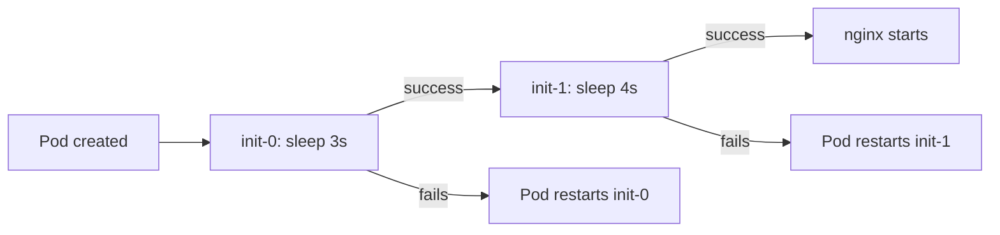
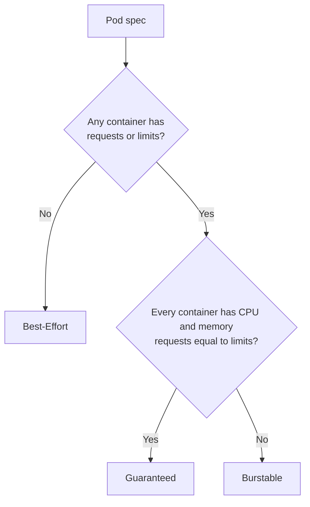

# Kubernetes Pods: Containers, Lifecycle, Resources and QoS

## What is a Pod?

A **Pod** is the smallest deployable unit in Kubernetes. It contains one or more containers.

All containers in a Pod:

- Run on the **same node**
- Share the **same IP address** and port space
- Can share **volumes**
- Are started and stopped as a unit

> **Analogy:** Think of a Pod as a *flat* (apartment). The containers are the *roommates*. They share one address (IP), one kitchen (volumes), and move in and out together.

Official docs: [Pods](https://kubernetes.io/docs/concepts/workloads/pods/)

---

## 2. Types of containers in a Pod

| Type | Purpose | Execution | Required? |
|---|---|---|---|
| `containers` | The application containers | Run **in parallel** | **Mandatory** |
| `initContainers` | Pre-conditions that must finish before the app sta0rts | Run **in sequence**, one at a time | Optional |
| `ephemeralContainers` | Temporary containers for **debugging** | Added to a running Pod | Optional |

### Details

- **containers**: this is your actual application. At least one is required.
- **init containers**: start first. The next init container starts only after the previous one **succeeds**. The app containers start only after **all** init containers finish.
  - Typical uses: wait for a database to be ready, download config, run a migration, set file permissions.
- **ephemeral containers**: cannot be defined in the Pod manifest. They are injected into a running Pod using `kubectl debug`.

```bash
# Add an ephemeral debug container to a running Pod
kubectl debug -it <pod-name> --image=busybox --target=<container-name>
```

---

## 3. Writing a Pod manifest

Every Kubernetes manifest has four top-level fields:

| Field | Meaning | Pod value |
|---|---|---|
| `apiVersion` | API group and version | `v1` |
| `kind` | Type of object | `Pod` |
| `metadata` | Name, labels, namespace | `name`, `labels` |
| `spec` | Desired state | `containers`, `initContainers`, ... |

**Metadata** fields used so far:

- `name`: unique name of the Pod in the namespace
- `labels`: key-value pairs used to **query and group** objects (for example `app=httpd`)

API reference: [Kubernetes API reference](https://kubernetes.io/docs/reference/generated/kubernetes-api/v1.35/)

```bash
# You can ask kubectl to explain any field
kubectl explain pod
kubectl explain pod.spec.containers
```

Practice environment: [Killercoda Playgrounds](https://killercoda.com/playgrounds)

---

## 4. Example 1: Pod with a single httpd container

**Goal:** run an `httpd` container inside a Pod.

```yaml
---
apiVersion: v1
kind: Pod
metadata:
  name: example-1
  labels:
    app: httpd
    purpose: learning
    env: dev
spec:
  containers:
    - name: httpd
      image: httpd:latest
      ports:
        - name: httpd
          protocol: TCP
          containerPort: 80
```

### Line-by-line

| Line | Explanation |
|---|---|
| `name: example-1` | Pod name |
| `labels` | Three labels for filtering later |
| `containers` | List (note the `-`) of application containers |
| `image: httpd:latest` | Apache HTTP server image from Docker Hub |
| `containerPort: 80` | Port the container listens on (informational; documents the port) |

### Run it

```bash
kubectl apply -f example-1.yaml
kubectl get pods
kubectl get pods --show-labels
kubectl get pods -l app=httpd          # filter using labels
kubectl delete pod example-1
```

---

## 5. Pod networking and lifecycle

### Networking

- Each Pod gets a **unique IP address**.
- Containers inside the same Pod reach each other through `localhost`.
- Two containers in one Pod **cannot use the same port**.

```bash
kubectl get pod example-1 -o wide      # shows the Pod IP and node
```

### Lifecycle

Official docs: [Pod lifecycle](https://kubernetes.io/docs/concepts/workloads/pods/pod-lifecycle/)


### Pod phases

| Phase | Meaning |
|---|---|
| `Pending` | Accepted by the cluster, but not all containers are running yet (scheduling, image pull, init containers) |
| `Running` | Bound to a node, at least one container is running |
| `Succeeded` | All containers exited with success (exit code 0) and will not restart |
| `Failed` | All containers terminated and at least one failed |
| `Unknown` | Pod state cannot be determined (usually node communication problem) |

### Container states

| State | Meaning |
|---|---|
| `Waiting` | Not running yet (pulling image, waiting for init containers) |
| `Running` | Executing normally |
| `Terminated` | Finished or failed |

### Restart policy

Set in `spec.restartPolicy`:

| Value | Behavior |
|---|---|
| `Always` (default) | Restart the container whenever it exits |
| `OnFailure` | Restart only when it exits with an error |
| `Never` | Never restart |

---

## 6. Example 2: Pod whose container exits

**Goal:** see what happens when a container finishes immediately. The `hello-world` image prints a message and exits.

```yaml
---
apiVersion: v1
kind: Pod
metadata:
  name: example-2
  labels:
    app: hello-world
    env: dev
    topic: "exiting-containers"
spec:
  containers:
    - name: suicidal
      image: hello-world:latest
```


### What you will observe

Because the default `restartPolicy` is `Always`, Kubernetes keeps restarting the container after each exit. The Pod status moves through:

```
Running -> Completed -> CrashLoopBackOff
```

`CrashLoopBackOff` means: the container keeps exiting and Kubernetes is waiting longer between each restart (10s, 20s, 40s, up to 5 minutes).

```bash
kubectl get pods
kubectl logs example-2
kubectl describe pod example-2
```

> **Lesson:** Containers in a Pod are meant to be **long-running processes**. For tasks that run once and finish, use a **Job** (or set `restartPolicy: Never` / `OnFailure`).

---

## 7. Example 3: Pod with two containers

**Goal:** one Pod with `nginx` and `tomcat`.

### Manifest as written in class (contains an error)

```yaml
spec:
  - name: nginx          # missing "containers:" key
    image: nginx:latest
```

`spec` must be a map, and the list of containers must sit under the `containers:` key.

### Corrected manifest

```yaml
---
apiVersion: v1
kind: Pod
metadata:
  name: example-3
  labels:
    app: web
    purpose: multi-container
spec:
  containers:
    - name: nginx
      image: nginx:latest
      ports:
        - containerPort: 80
    - name: tomcat
      image: tomcat:latest
      ports:
        - containerPort: 8080
```

### Key points

- Both containers share the Pod IP: nginx is reachable on port **80**, tomcat on port **8080**.
- Ports must be different, otherwise the second container fails to start.
- `READY` shows `2/2` when both containers are running.

```bash
kubectl get pod example-3                      # READY 2/2
kubectl logs example-3 -c nginx                # -c selects the container
kubectl logs example-3 -c tomcat
kubectl exec -it example-3 -c nginx -- sh
```

> **When to use multi-container Pods:** only when containers are tightly coupled (sidecar for logging, proxy, or config reload). Do **not** put a web app and its database in the same Pod.

---

## 8. Example 4: Init containers

**Goal:** run two init containers (sleep 3s, then sleep 4s) before starting nginx.

```yaml
---
apiVersion: v1
kind: Pod
metadata:
  name: example-4
  labels:
    purpose: init-container-demo
    app: nginx
spec:
  initContainers:
    - name: init-0
      image: alpine
      command:
        - sleep
        - "3s"
    - name: init-1
      image: alpine
      command:
        - sleep
        - "4s"
  containers:
    - name: nginx
      image: nginx:latest
      ports:
        - containerPort: 80
```


### Execution flow



### Status you will see

```bash
kubectl get pod example-4 -w
```

```
NAME        READY   STATUS            RESTARTS   AGE
example-4   0/1     Init:0/2          0          1s     # init-0 running
example-4   0/1     Init:1/2          0          4s     # init-1 running
example-4   0/1     PodInitializing   0          8s     # init done, starting nginx
example-4   1/1     Running           0          10s
```

`Init:1/2` means 1 of 2 init containers has completed.

### Real-world init container example

Wait until a database service is reachable before starting the app:

```yaml
initContainers:
  - name: wait-for-db
    image: busybox
    command: ['sh', '-c', 'until nc -z mysql 3306; do echo waiting for db; sleep 2; done']
```

### Init containers vs app containers

| Feature | Init containers | App containers |
|---|---|---|
| Run order | Sequential | Parallel |
| Must complete | Yes, successfully | No (long-running) |
| Probes (liveness/readiness) | Not supported | Supported |
| Purpose | Setup and pre-conditions | Main workload |

---

## 9. Resources: requests and limits

Official docs: [Managing resources for containers](https://kubernetes.io/docs/concepts/configuration/manage-resources-containers/) and [resource types](https://kubernetes.io/docs/concepts/configuration/manage-resources-containers/#resource-types)

You tell Kubernetes how much CPU and memory a container needs using `resources`.

| Setting | Meaning | Used by |
|---|---|---|
| `requests` | **Minimum** the container needs (guaranteed to it) | **Scheduler**, to choose a node |
| `limits` | **Maximum** the container may use | **Kubelet / runtime**, to enforce |

```yaml
resources:
  requests:
    cpu: "250m"
    memory: "128Mi"
  limits:
    cpu: "500m"
    memory: "256Mi"
```

### Units

| Resource | Unit | Example |
|---|---|---|
| CPU | cores; `m` = millicore | `1` = 1 core, `500m` = 0.5 core, `100m` = 0.1 core |
| Memory | bytes; `Mi` / `Gi` | `128Mi`, `1Gi` |

> Use `Mi` and `Gi` (binary), not `M` and `G` (decimal), to avoid confusion.

### What happens when limits are exceeded

| Resource | Behavior |
|---|---|
| CPU | Container is **throttled** (slowed down) |
| Memory | Container is **killed** (`OOMKilled`) and restarted |

### Impact on scheduling

The scheduler compares the Pod's **requests** (not limits) with free capacity on each node.

```
Node has 2 CPU, already allocated 1.5 CPU
New Pod requests 1 CPU  ->  does NOT fit  ->  Pod stays Pending
New Pod requests 0.4 CPU ->  fits         ->  scheduled
```

```bash
kubectl describe pod <name>
# Events: 0/3 nodes are available: 3 Insufficient cpu.
```

The YAML files used in class to observe the effect of resources on Pods and scheduling are in this repository commit: [KubernetesZone commit](https://github.com/asquarezone/KubernetesZone/commit/4de6d60f803f6e8266bff02dabe626f570bea6c2)

---

## 10. Quality of Service (QoS) classes

Official docs: [Pod QoS classes](https://kubernetes.io/docs/concepts/workloads/pods/pod-qos/)

Kubernetes assigns every Pod one of **three QoS classes** based on the resources declared.

| QoS class | Condition | Priority under pressure |
|---|---|---|
| **Guaranteed** | Every container has CPU and memory **requests = limits** | Highest (evicted last) |
| **Burstable** | At least one request or limit is set, but not Guaranteed (requests < limits) | Medium |
| **Best-Effort** | **No** requests or limits at all | Lowest (evicted first) |

### As explained in class

- No resources mentioned: **Best-Effort**
- Minimum (request) and maximum (limit) mentioned:
  - minimum **<** maximum: **Burstable**
  - minimum **==** maximum: **Guaranteed**

### Decision flow



### Exact rules for Guaranteed

For a Pod to be Guaranteed, **every container** (including init containers) must have:

- A CPU limit and a memory limit
- A CPU request and a memory request
- Requests equal to limits for both

> If you set only `limits`, Kubernetes copies them into `requests`, so the Pod becomes Guaranteed.

### Why QoS matters

When a node runs out of memory, the kubelet **evicts Pods** to free resources, in this order:

```
1. Best-Effort   (first to be evicted)
2. Burstable     (those using more than their request, first)
3. Guaranteed    (last)
```

| Class | Use for |
|---|---|
| Best-Effort | Dev, tests, throw-away workloads |
| Burstable | Most normal applications |
| Guaranteed | Critical workloads (databases, payment services) |

```bash
# Check the QoS class of a Pod
kubectl get pod <name> -o jsonpath='{.status.qosClass}'
```

---

## 11. QoS examples

### 11.1 Best-Effort

No resources mentioned.

```yaml
---
apiVersion: v1
kind: Pod
metadata:
  name: best-efforts
  labels:
    app: httpd
    purpose: learning
    env: dev
spec:
  containers:
    - name: httpd
      image: httpd:latest
      ports:
        - name: httpd
          protocol: TCP
          containerPort: 80
```

- The scheduler places this Pod on **any** node, since it asks for nothing.
- It is the first candidate for eviction when a node is under pressure.

### 11.2 Burstable (requests < limits)

```yaml
---
apiVersion: v1
kind: Pod
metadata:
  name: burstable
  labels:
    app: httpd
    purpose: learning
    env: dev
spec:
  containers:
    - name: httpd
      image: httpd:latest
      ports:
        - name: httpd
          protocol: TCP
          containerPort: 80
      resources:
        requests:
          cpu: "250m"
          memory: "128Mi"
        limits:
          cpu: "500m"
          memory: "256Mi"
```

- Scheduled on a node with at least 250m CPU and 128Mi memory free.
- Can **burst** up to 500m CPU and 256Mi memory if the node has spare capacity.

### 11.3 Guaranteed (requests == limits)

```yaml
---
apiVersion: v1
kind: Pod
metadata:
  name: guaranteed
  labels:
    app: httpd
    purpose: learning
    env: dev
spec:
  containers:
    - name: httpd
      image: httpd:latest
      ports:
        - name: httpd
          protocol: TCP
          containerPort: 80
      resources:
        requests:
          cpu: "500m"
          memory: "256Mi"
        limits:
          cpu: "500m"
          memory: "256Mi"
```

- Gets exactly what it asked for, always reserved.
- Last to be evicted.

### 11.4 Pending example: requesting too much

```yaml
resources:
  requests:
    cpu: "100"          # 100 cores, more than any node has
    memory: "512Gi"
```

The Pod stays `Pending`:

```bash
kubectl describe pod <name>
# Warning  FailedScheduling  0/3 nodes are available: 3 Insufficient cpu, 3 Insufficient memory.
```

### Comparison

| | Best-Effort | Burstable | Guaranteed |
|---|---|---|---|
| Requests | None | Set | Set |
| Limits | None | Set (higher) or partial | Set (= requests) |
| Resource reserved | No | Request amount | Full amount |
| Can use more than requested | Yes, anything free | Up to limit | No |
| Eviction order | 1st | 2nd | 3rd |
| Typical use | Testing | General apps | Critical apps |

---

## 12. Inspecting Pods

`kubectl` has two main commands to inspect any object:

```bash
kubectl get <type> <name>               # summary
kubectl get <type> <name> -o yaml       # full object (spec + status)
kubectl describe <type> <name>          # detailed view with Events
```

### Examples

```bash
kubectl get pods
kubectl get pods -o wide                         # adds IP and node
kubectl get pods --show-labels
kubectl get pod example-1 -o yaml
kubectl describe pod example-1
kubectl logs example-1
kubectl logs example-3 -c tomcat                 # multi-container Pod
kubectl logs example-2 --previous                # logs of the previous (crashed) run
kubectl exec -it example-1 -- bash
kubectl get events --sort-by=.metadata.creationTimestamp
```

### What to look at in `kubectl describe`

| Section | Tells you |
|---|---|
| `Status`, `IP`, `Node` | Current phase, Pod IP, where it runs |
| `Containers` | Image, state, restart count, requests and limits |
| `QoS Class` | Best-Effort, Burstable, or Guaranteed |
| `Conditions` | Initialized, Ready, ContainersReady, PodScheduled |
| `Events` | Scheduling, image pull, start, failure messages (**check here first when something breaks**) |

### Common Pod errors

| Status | Cause | Fix |
|---|---|---|
| `Pending` | No node has enough resources, or scheduling constraints unmet | Lower requests or add capacity |
| `ImagePullBackOff` / `ErrImagePull` | Wrong image name/tag, or registry auth failure | Fix image name, add `imagePullSecrets` |
| `CrashLoopBackOff` | Container keeps exiting | `kubectl logs --previous`, fix the command or app |
| `OOMKilled` | Memory limit exceeded | Increase memory limit or fix leak |
| `Init:Error` / `Init:CrashLoopBackOff` | Init container failing | `kubectl logs <pod> -c <init-name>` |

---

## 13. Finding what can be created: `kubectl api-resources`

To see every resource type your cluster supports:

```bash
kubectl api-resources
```


### Reading the output

| Column | Meaning |
|---|---|
| `NAME` | Resource name (`pods`, `deployments`, ...) |
| `SHORTNAMES` | Shortcut (`po`, `deploy`, `svc`, `rs`) |
| `APIVERSION` | Value for `apiVersion` in the manifest (`v1`, `apps/v1`, ...) |
| `NAMESPACED` | `true` if the resource lives inside a namespace |
| `KIND` | Value for `kind` in the manifest |

### Handy variations

```bash
kubectl api-resources --namespaced=true       # only namespaced resources
kubectl api-resources --api-group=apps        # only the apps group
kubectl api-resources -o wide                 # shows supported verbs
kubectl api-versions                          # list all API versions
kubectl explain deployment.spec               # explain fields of any resource
```

> **Tip:** to write a manifest for any resource, use `api-resources` to get the `apiVersion` and `kind`, then `kubectl explain` to learn its fields.

---

## 14. AI prompts for understanding manifests

Two prompts shared in class for learning with an AI assistant.

**1. Understand a manifest from the API server's point of view**

```
You are kubernetes api-server. I will give you k8s manifest
tell me what you will be doing and give me in plain english what the manifest is all about.
```

**2. Understand a manifest and learn best practices**

```
you are kubernetes expert, I will give you manifest files, explain what it does and also suggest me best practices around this manifest
```

---

## 15. Cheat sheet and practice exercises

### Summary

| Concept | Key point |
|---|---|
| Pod | Smallest unit; one or more containers sharing IP and volumes |
| `containers` | Mandatory, run in parallel |
| `initContainers` | Optional, run sequentially before app containers |
| Ephemeral containers | Debugging only, added with `kubectl debug` |
| Labels | Key-value pairs used for querying (`-l app=httpd`) |
| Pod IP | Unique per Pod |
| `restartPolicy` | `Always` (default), `OnFailure`, `Never` |
| `requests` | Minimum; used for scheduling |
| `limits` | Maximum; enforced at runtime |
| Best-Effort | No requests or limits |
| Burstable | requests < limits |
| Guaranteed | requests == limits (CPU and memory, all containers) |

### Command cheat sheet

```bash
kubectl apply -f pod.yaml
kubectl get pods -o wide --show-labels
kubectl describe pod <name>
kubectl get pod <name> -o yaml
kubectl logs <name> [-c container] [--previous]
kubectl exec -it <name> -- sh
kubectl delete pod <name>
kubectl api-resources
kubectl explain pod.spec
```

### Practice exercises

1. Create `example-1` and list it using the label `app=httpd`.
2. Create `example-2` and explain why it ends in `CrashLoopBackOff`. Then add `restartPolicy: Never` and observe the difference.
3. Create `example-3` using the corrected manifest. Use `kubectl logs -c` for each container.
4. Create `example-4`, watch it with `kubectl get pod -w`, and note each status.
5. Change the init container in `example-4` to `command: ["sh", "-c", "exit 1"]`. What status do you see and why?
6. Create the three QoS Pods (`best-efforts`, `burstable`, `guaranteed`) and confirm each class with:
   `kubectl get pod <name> -o jsonpath='{.status.qosClass}'`
7. Create a Pod requesting `cpu: "100"`. Why is it `Pending`? Find the reason in `kubectl describe`.
8. Run `kubectl api-resources` and find the `apiVersion` and `kind` for Deployment, then write a Deployment manifest using `kubectl explain`.
