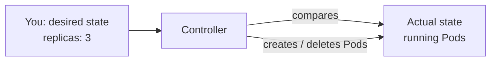
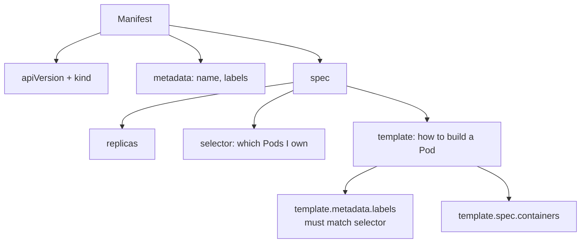
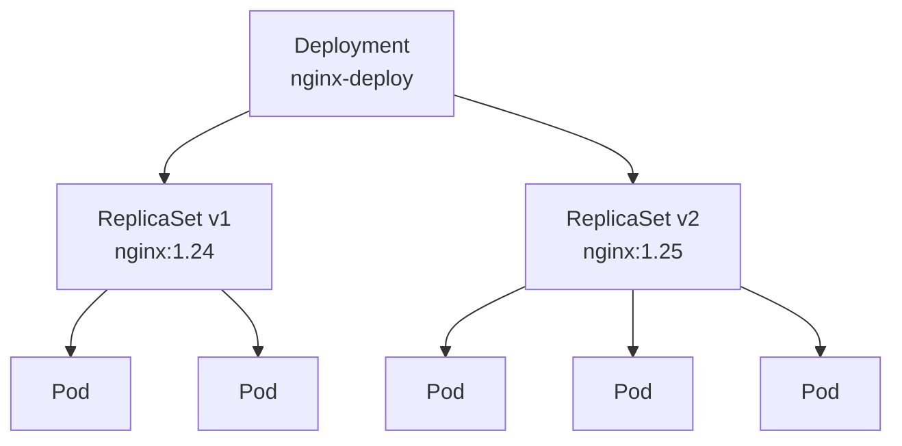
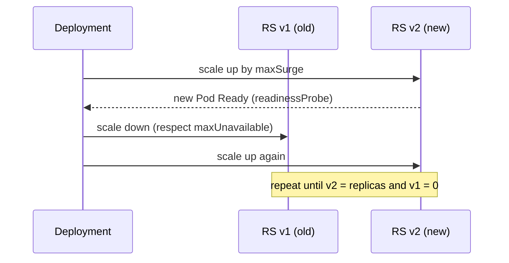
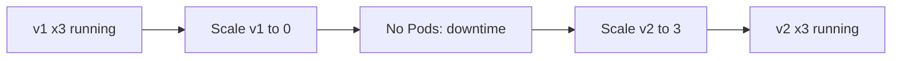
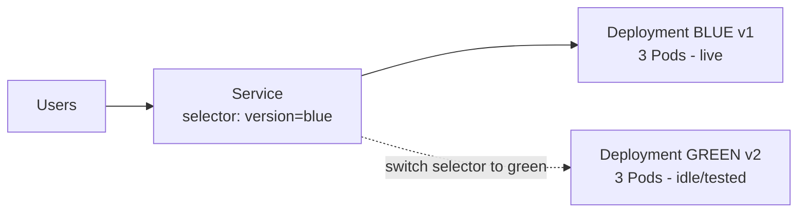
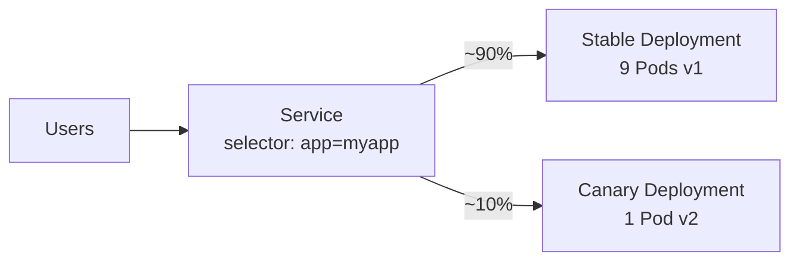

# Kubernetes: ReplicationController, ReplicaSet, Deployment & Deployment Strategies

## 1. Why do we need controllers?

A bare **Pod** is not self-healing. If the Pod crashes or the node dies, nobody recreates it.
Controllers watch the cluster and keep the **actual state** equal to the **desired state**.



Evolution of controllers:

```
Pod  ->  ReplicationController (old)  ->  ReplicaSet (new)  ->  Deployment (recommended)
```

---

## 2. ReplicationController (RC)

- The **original** way to keep N identical Pods running.
- Uses **equality-based selectors** only (`app = web`).
- **Legacy**: replaced by ReplicaSet. Know it for exams/interviews, do not use for new work.

### Manifest

```yaml
apiVersion: v1
kind: ReplicationController
metadata:
  name: nginx-rc
  labels:
    app: nginx
spec:
  replicas: 3                # desired number of Pods
  selector:                  # which Pods this RC owns (equality-based)
    app: nginx
  template:                  # Pod template used to create Pods
    metadata:
      labels:
        app: nginx           # MUST match selector
    spec:
      containers:
        - name: nginx
          image: nginx:1.25
          ports:
            - containerPort: 80
```

### Commands

```bash
kubectl apply -f rc.yaml
kubectl get rc
kubectl get pods -l app=nginx
kubectl scale rc nginx-rc --replicas=5
kubectl delete pod <pod-name>        # RC recreates it automatically
kubectl delete rc nginx-rc
```

---

## 3. ReplicaSet (RS)

- The **next-generation** RC.
- Supports **set-based selectors** (`matchExpressions`: `In`, `NotIn`, `Exists`, `DoesNotExist`) plus `matchLabels`.
- Usually **not created directly**: a Deployment creates and manages ReplicaSets for you.

### Manifest

```yaml
apiVersion: apps/v1          # note: apps/v1, not v1
kind: ReplicaSet
metadata:
  name: nginx-rs
  labels:
    app: nginx
spec:
  replicas: 3
  selector:                  # REQUIRED in apps/v1
    matchLabels:
      app: nginx
    # matchExpressions:      # set-based alternative
    #   - key: tier
    #     operator: In
    #     values: [frontend, web]
  template:
    metadata:
      labels:
        app: nginx           # MUST satisfy the selector
    spec:
      containers:
        - name: nginx
          image: nginx:1.25
          ports:
            - containerPort: 80
```

### How a manifest is written (anatomy)



### Commands

```bash
kubectl apply -f rs.yaml
kubectl get rs
kubectl describe rs nginx-rs
kubectl scale rs nginx-rs --replicas=5
kubectl delete rs nginx-rs
```

### Self-healing demo

```bash
kubectl get pods -l app=nginx
kubectl delete pod <one-pod-name>
kubectl get pods -l app=nginx -w     # a new Pod appears immediately
```

### RC vs RS

| Feature | ReplicationController | ReplicaSet |
|---|---|---|
| apiVersion | `v1` | `apps/v1` |
| Selector type | Equality-based | Equality + set-based |
| `selector` field | Optional (defaults to template labels) | Required |
| Status | Deprecated / legacy | Current (used by Deployment) |
| Rolling updates | `kubectl rolling-update` (removed) | Via Deployment |

> **Limitation of RS:** if you change the image in an RS, existing Pods are **not** updated. Only newly created Pods use the new image. This is why we need Deployments.

---

## 4. Deployment

A **Deployment** manages ReplicaSets and gives you:

- Rolling updates with zero downtime
- Rollbacks
- Revision history
- Pause / resume
- Scaling



Hierarchy: **Deployment -> ReplicaSet -> Pods**. Every change to the Pod template creates a **new ReplicaSet**; the old one is scaled down to 0 but kept for rollback.

### Manifest

```yaml
apiVersion: apps/v1
kind: Deployment
metadata:
  name: nginx-deploy
  labels:
    app: nginx
spec:
  replicas: 3
  revisionHistoryLimit: 10        # old ReplicaSets kept for rollback
  selector:
    matchLabels:
      app: nginx
  strategy:
    type: RollingUpdate           # or Recreate
    rollingUpdate:
      maxSurge: 1                 # extra Pods allowed above replicas
      maxUnavailable: 1           # Pods allowed to be down during update
  template:
    metadata:
      labels:
        app: nginx
    spec:
      containers:
        - name: nginx
          image: nginx:1.24
          ports:
            - containerPort: 80
          readinessProbe:         # important for safe rollouts
            httpGet:
              path: /
              port: 80
            initialDelaySeconds: 5
            periodSeconds: 5
          resources:
            requests:
              cpu: 100m
              memory: 64Mi
            limits:
              cpu: 250m
              memory: 128Mi
```

### Commands

```bash
# Create
kubectl apply -f deploy.yaml
kubectl get deploy,rs,pods -l app=nginx

# Update image (triggers a rollout)
kubectl set image deployment/nginx-deploy nginx=nginx:1.25
# or edit the YAML and: kubectl apply -f deploy.yaml

# Watch rollout
kubectl rollout status deployment/nginx-deploy

# History
kubectl rollout history deployment/nginx-deploy
kubectl rollout history deployment/nginx-deploy --revision=2

# Rollback
kubectl rollout undo deployment/nginx-deploy
kubectl rollout undo deployment/nginx-deploy --to-revision=1

# Scale
kubectl scale deployment nginx-deploy --replicas=5

# Pause / resume (batch multiple changes)
kubectl rollout pause deployment/nginx-deploy
kubectl rollout resume deployment/nginx-deploy

# Restart all Pods (new rollout, same spec)
kubectl rollout restart deployment/nginx-deploy
```

---

## 5. Deployment Strategies

### 5.1 Built-in strategies

#### A) RollingUpdate (default)

Pods are replaced gradually, so the app stays available.

- `maxSurge`: how many Pods **above** the desired count can exist during update (number or %). Default `25%`.
- `maxUnavailable`: how many Pods can be **unavailable** during update (number or %). Default `25%`.

Example: `replicas: 3`, `maxSurge: 1`, `maxUnavailable: 0`

```
Start     : [v1] [v1] [v1]
Step 1    : [v1] [v1] [v1] [v2]        <- surge +1, new Pod starts
Step 2    : [v1] [v1] [v2] [v2]        <- v2 Ready, one v1 removed
Step 3    : [v1] [v2] [v2] [v2]
Done      : [v2] [v2] [v2]
```



```yaml
strategy:
  type: RollingUpdate
  rollingUpdate:
    maxSurge: 1
    maxUnavailable: 0      # zero-downtime
```

| Pros | Cons |
|---|---|
| No downtime | v1 and v2 run together briefly (must be backward compatible) |
| Easy rollback | Slower than Recreate |
| No extra tooling | Needs good readiness probes |

#### B) Recreate

All old Pods are killed first, then new Pods are created. **Downtime occurs.**

```
Start  : [v1] [v1] [v1]
Step 1 : (all v1 terminated)           <- DOWNTIME
Step 2 : [v2] [v2] [v2]
```



```yaml
strategy:
  type: Recreate
```

Use when: the app cannot run two versions at once (DB schema lock, singleton, shared volume with exclusive access) or downtime is acceptable (dev/test).

### 5.2 Strategies built with labels and Services (patterns)

These are **not** `strategy.type` values; you implement them using multiple Deployments and a Service selector.

#### C) Blue/Green

Run two full environments. Switch traffic instantly by changing the Service selector.



```yaml
# blue.yaml
apiVersion: apps/v1
kind: Deployment
metadata:
  name: app-blue
spec:
  replicas: 3
  selector:
    matchLabels: { app: myapp, version: blue }
  template:
    metadata:
      labels: { app: myapp, version: blue }
    spec:
      containers:
        - name: app
          image: nginx:1.24
          ports:
            - containerPort: 80
---
# green.yaml
apiVersion: apps/v1
kind: Deployment
metadata:
  name: app-green
spec:
  replicas: 3
  selector:
    matchLabels: { app: myapp, version: green }
  template:
    metadata:
      labels: { app: myapp, version: green }
    spec:
      containers:
        - name: app
          image: nginx:1.25
          ports:
            - containerPort: 80
---
# service.yaml
apiVersion: v1
kind: Service
metadata:
  name: myapp-svc
spec:
  selector:
    app: myapp
    version: blue          # change to green to cut over
  ports:
    - port: 80
      targetPort: 80
```

```bash
# Cut over to green
kubectl patch svc myapp-svc -p '{"spec":{"selector":{"app":"myapp","version":"green"}}}'
# Roll back instantly
kubectl patch svc myapp-svc -p '{"spec":{"selector":{"app":"myapp","version":"blue"}}}'
```

| Pros | Cons |
|---|---|
| Instant switch and instant rollback | Double the resources while both run |
| Test green fully before go-live | DB/schema changes need care |

#### D) Canary

Send a **small share** of traffic to the new version first. The Service selects only the common label (`app: myapp`), so traffic splits roughly by Pod count.



```yaml
# stable: 9 replicas
apiVersion: apps/v1
kind: Deployment
metadata:
  name: app-stable
spec:
  replicas: 9
  selector:
    matchLabels: { app: myapp, track: stable }
  template:
    metadata:
      labels: { app: myapp, track: stable }
    spec:
      containers:
        - name: app
          image: nginx:1.24
---
# canary: 1 replica
apiVersion: apps/v1
kind: Deployment
metadata:
  name: app-canary
spec:
  replicas: 1
  selector:
    matchLabels: { app: myapp, track: canary }
  template:
    metadata:
      labels: { app: myapp, track: canary }
    spec:
      containers:
        - name: app
          image: nginx:1.25
---
# service selects only app=myapp (both tracks)
apiVersion: v1
kind: Service
metadata:
  name: myapp-svc
spec:
  selector:
    app: myapp
  ports:
    - port: 80
      targetPort: 80
```

Promote: scale canary up and stable down gradually, then update stable to the new image and delete canary.
For precise percentage splits use an Ingress controller (e.g. NGINX canary annotations) or a service mesh (Istio, Linkerd), or Argo Rollouts.

### 5.3 Strategy comparison

| Strategy | Downtime | Extra resources | Rollback speed | Complexity | Typical use |
|---|---|---|---|---|---|
| Recreate | Yes | None | Slow (redeploy) | Low | Dev/test, singleton apps |
| RollingUpdate | No | Small (`maxSurge`) | Fast (`rollout undo`) | Low | Default for most apps |
| Blue/Green | No | 2x | Instant | Medium | Critical releases |
| Canary | No | Small | Fast | High | Risk-controlled releases |

---

## 6. End-to-end sample

### Step 1: `app.yaml` (Deployment + Service)

```yaml
apiVersion: apps/v1
kind: Deployment
metadata:
  name: web
  labels:
    app: web
spec:
  replicas: 4
  selector:
    matchLabels:
      app: web
  strategy:
    type: RollingUpdate
    rollingUpdate:
      maxSurge: 1
      maxUnavailable: 1
  template:
    metadata:
      labels:
        app: web
    spec:
      containers:
        - name: web
          image: nginx:1.24
          ports:
            - containerPort: 80
          readinessProbe:
            httpGet:
              path: /
              port: 80
            initialDelaySeconds: 3
            periodSeconds: 5
---
apiVersion: v1
kind: Service
metadata:
  name: web-svc
spec:
  type: NodePort
  selector:
    app: web
  ports:
    - port: 80
      targetPort: 80
      nodePort: 30080
```

### Step 2: Deploy and verify

```bash
kubectl apply -f app.yaml
kubectl get deploy,rs,pods,svc -l app=web
```

### Step 3: Rolling update

```bash
kubectl set image deployment/web web=nginx:1.25
kubectl rollout status deployment/web
kubectl get rs -l app=web          # old RS = 0 Pods, new RS = 4 Pods
```

### Step 4: Simulate a bad release and roll back

```bash
kubectl set image deployment/web web=nginx:does-not-exist
kubectl rollout status deployment/web --timeout=30s    # stuck, Pods in ImagePullBackOff
kubectl get pods -l app=web                            # old Pods still serving traffic
kubectl rollout undo deployment/web
kubectl rollout status deployment/web
```

### Step 5: Switch to Recreate (observe downtime)

```bash
kubectl patch deployment web -p '{"spec":{"strategy":{"type":"Recreate","rollingUpdate":null}}}'
kubectl set image deployment/web web=nginx:1.24
kubectl get pods -l app=web -w
```

### Step 6: Cleanup

```bash
kubectl delete -f app.yaml
```

---

## 7. Cheat sheet

| Task | Command |
|---|---|
| Apply manifest | `kubectl apply -f file.yaml` |
| List RC / RS / Deploy | `kubectl get rc` / `rs` / `deploy` |
| Scale | `kubectl scale deploy NAME --replicas=N` |
| Update image | `kubectl set image deploy/NAME CONTAINER=IMAGE:TAG` |
| Rollout status | `kubectl rollout status deploy/NAME` |
| History | `kubectl rollout history deploy/NAME` |
| Rollback | `kubectl rollout undo deploy/NAME [--to-revision=N]` |
| Restart | `kubectl rollout restart deploy/NAME` |
| Pause / resume | `kubectl rollout pause\|resume deploy/NAME` |
| Describe | `kubectl describe deploy NAME` |

### Key points to remember

1. Pod template labels **must match** the selector, or the API server rejects the object.
2. Use **Deployment**, not bare RS or RC, for stateless apps.
3. A Deployment owns ReplicaSets; ReplicaSets own Pods.
4. Changing `spec.template` triggers a rollout; changing only `replicas` does not.
5. Always add a **readinessProbe** so rolling updates only shift traffic to healthy Pods.
6. `maxUnavailable: 0` + `maxSurge: 1` gives the safest zero-downtime rollout.
7. Blue/Green and Canary are patterns built from labels, Services, Ingress or a mesh, not `strategy.type` values.
