# Kubernetes Workloads & Deployment Strategies

Deployment, DaemonSet, StatefulSet, Job, CronJob, and the strategies used to roll out applications.

---

## 1. Workload Controllers: Overview

A **workload controller** keeps the actual state of Pods matching the desired state you declare in YAML.

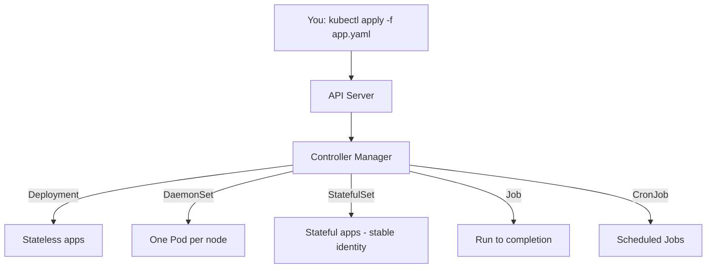

| Controller | Use it for | Pod identity | Runs |
|---|---|---|---|
| Deployment | Stateless apps (web, API) | Random names, interchangeable | Continuously |
| DaemonSet | Node-level agents (logging, monitoring) | One per node | Continuously |
| StatefulSet | Databases, Kafka, Zookeeper | Stable name + stable storage | Continuously |
| Job | Batch task, migration | Random | Until completion |
| CronJob | Scheduled batch task, backups | Random | On a schedule |

---

## 2. Deployment

A **Deployment** manages **ReplicaSets**, which in turn manage **Pods**. It provides:

- Desired replica count and self-healing
- Rolling updates and rollbacks
- Revision history

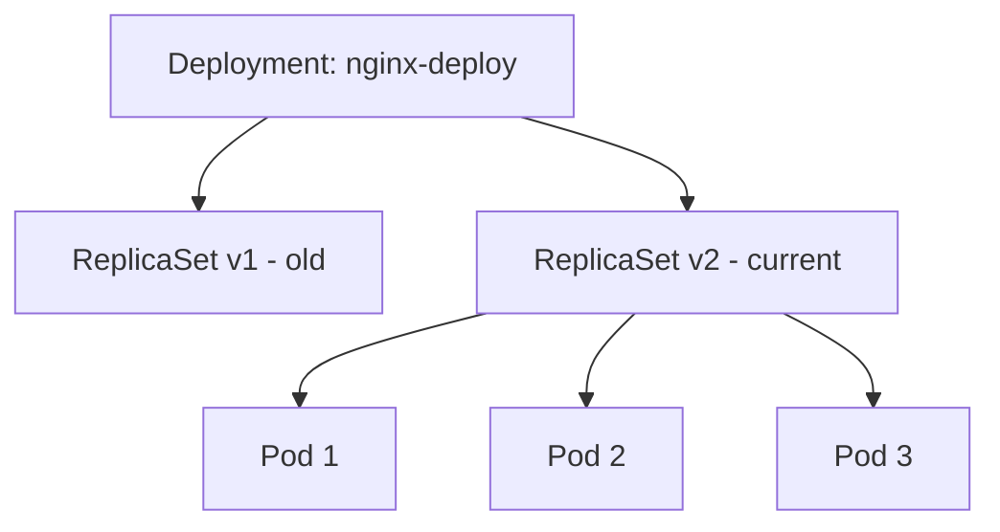

### Example

```yaml
apiVersion: apps/v1
kind: Deployment
metadata:
  name: nginx-deploy
  labels:
    app: nginx
spec:
  replicas: 3
  selector:
    matchLabels:
      app: nginx
  strategy:
    type: RollingUpdate
    rollingUpdate:
      maxSurge: 1
      maxUnavailable: 0
  template:
    metadata:
      labels:
        app: nginx
    spec:
      containers:
        - name: nginx
          image: nginx:1.25
          ports:
            - containerPort: 80
          readinessProbe:
            httpGet:
              path: /
              port: 80
            initialDelaySeconds: 3
            periodSeconds: 5
```

### Common commands

```bash
kubectl apply -f deploy.yaml
kubectl get deploy,rs,pods
kubectl scale deploy nginx-deploy --replicas=5
kubectl set image deploy/nginx-deploy nginx=nginx:1.26
kubectl rollout status deploy/nginx-deploy
kubectl rollout history deploy/nginx-deploy
kubectl rollout undo deploy/nginx-deploy
kubectl rollout undo deploy/nginx-deploy --to-revision=1
```

---

## 3. DaemonSet

A **DaemonSet** ensures **one Pod runs on every node** (or on selected nodes). New node joins the cluster → Pod is added automatically. Node removed → Pod is garbage collected.

**Use cases:** log collectors (Fluentd, Filebeat), monitoring agents (node-exporter, Datadog), network plugins (CNI), storage daemons.

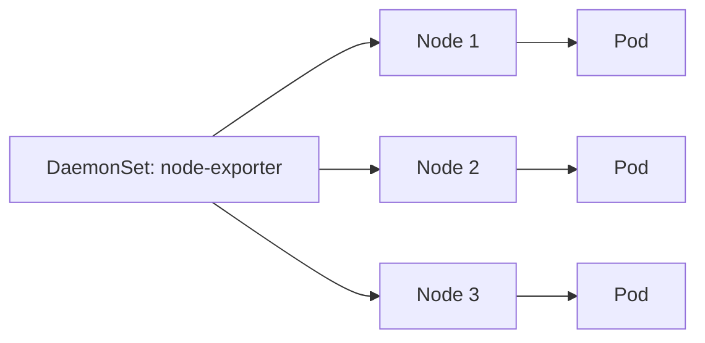

### Example

```yaml
apiVersion: apps/v1
kind: DaemonSet
metadata:
  name: node-exporter
spec:
  selector:
    matchLabels:
      app: node-exporter
  updateStrategy:
    type: RollingUpdate
    rollingUpdate:
      maxUnavailable: 1
  template:
    metadata:
      labels:
        app: node-exporter
    spec:
      tolerations:
        - key: node-role.kubernetes.io/control-plane
          operator: Exists
          effect: NoSchedule
      containers:
        - name: node-exporter
          image: prom/node-exporter:latest
          ports:
            - containerPort: 9100
```

> Use `nodeSelector` or `nodeAffinity` to run only on specific nodes. Use `tolerations` to also run on control-plane (tainted) nodes.

---

## 4. StatefulSet

A **StatefulSet** is for apps that need:

1. **Stable, unique Pod names:** `db-0`, `db-1`, `db-2`
2. **Stable network identity** via a headless Service
3. **Stable persistent storage:** each Pod gets its own PVC that follows it across restarts
4. **Ordered start/stop:** `0 → 1 → 2` up, `2 → 1 → 0` down

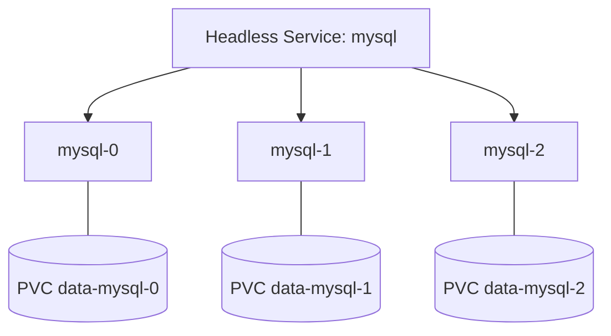

DNS per Pod: `mysql-0.mysql.default.svc.cluster.local`

### Example

```yaml
apiVersion: v1
kind: Service
metadata:
  name: mysql
spec:
  clusterIP: None          # headless
  selector:
    app: mysql
  ports:
    - port: 3306
---
apiVersion: apps/v1
kind: StatefulSet
metadata:
  name: mysql
spec:
  serviceName: mysql
  replicas: 3
  selector:
    matchLabels:
      app: mysql
  template:
    metadata:
      labels:
        app: mysql
    spec:
      containers:
        - name: mysql
          image: mysql:8.0
          env:
            - name: MYSQL_ROOT_PASSWORD
              value: "changeme"
          ports:
            - containerPort: 3306
          volumeMounts:
            - name: data
              mountPath: /var/lib/mysql
  volumeClaimTemplates:
    - metadata:
        name: data
      spec:
        accessModes: ["ReadWriteOnce"]
        resources:
          requests:
            storage: 5Gi
```

### Deployment vs StatefulSet

| | Deployment | StatefulSet |
|---|---|---|
| Pod names | Random hash | Ordered index (`-0`, `-1`) |
| Storage | Shared / ephemeral | Dedicated PVC per Pod |
| Scaling order | Parallel | Ordered (configurable) |
| Network ID | Via Service (load balanced) | Per-Pod DNS via headless Service |
| Typical use | Web, API | DB, queues, clustered systems |

> Deleting a StatefulSet does **not** delete its PVCs. Clean them up manually.

---

## 5. Job

A **Job** creates one or more Pods and ensures a specified number **complete successfully**. Failed Pods are retried.

**Use cases:** DB migration, data import, one-off batch processing.

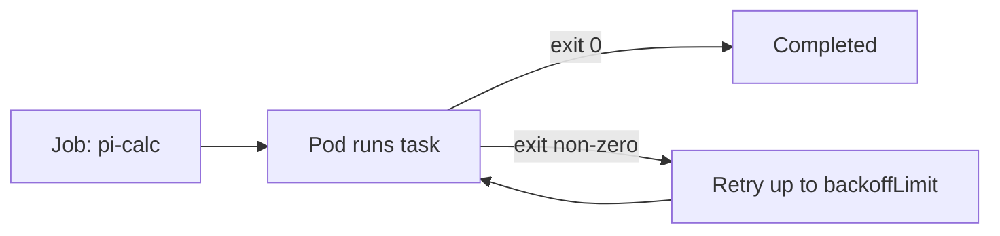

### Example: single run

```yaml
apiVersion: batch/v1
kind: Job
metadata:
  name: pi-calc
spec:
  backoffLimit: 4
  ttlSecondsAfterFinished: 300
  template:
    spec:
      restartPolicy: Never      # Never or OnFailure only
      containers:
        - name: pi
          image: perl:5.34
          command: ["perl", "-Mbignum=bpi", "-wle", "print bpi(2000)"]
```

### Example: parallel Job

```yaml
spec:
  completions: 6      # total successful Pods needed
  parallelism: 2      # Pods running at the same time
```

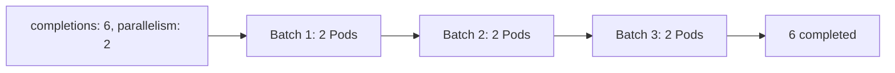

```bash
kubectl apply -f job.yaml
kubectl get jobs
kubectl logs job/pi-calc
```

---

## 6. CronJob

A **CronJob** creates a **Job on a schedule** using cron syntax.

```
┌───────── minute (0-59)
│ ┌─────── hour (0-23)
│ │ ┌───── day of month (1-31)
│ │ │ ┌─── month (1-12)
│ │ │ │ ┌─ day of week (0-6, Sun=0)
* * * * *
```

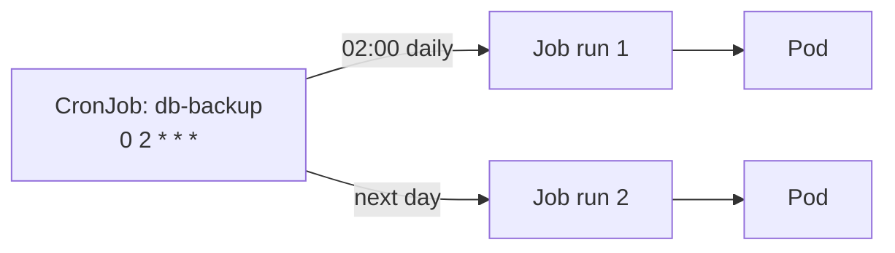

### Example

```yaml
apiVersion: batch/v1
kind: CronJob
metadata:
  name: db-backup
spec:
  schedule: "0 2 * * *"
  concurrencyPolicy: Forbid
  successfulJobsHistoryLimit: 3
  failedJobsHistoryLimit: 1
  startingDeadlineSeconds: 120
  jobTemplate:
    spec:
      backoffLimit: 2
      template:
        spec:
          restartPolicy: OnFailure
          containers:
            - name: backup
              image: busybox:1.36
              command: ["sh", "-c", "echo Backup at $(date)"]
```

### Key fields

| Field | Meaning |
|---|---|
| `schedule` | Cron expression |
| `concurrencyPolicy` | `Allow` (default), `Forbid` (skip if previous running), `Replace` (kill old, start new) |
| `suspend` | `true` pauses the schedule |
| `successfulJobsHistoryLimit` | Finished Jobs to keep |
| `startingDeadlineSeconds` | How late a missed run may still start |

---

## 7. Deployment Strategies

How you move users from the old version to the new version.

| Strategy | Native in K8s? | Downtime | Extra resources | Rollback speed |
|---|---|---|---|---|
| Recreate | Yes | Yes | None | Slow |
| Rolling Update | Yes | No | Low | Medium |
| Blue/Green | Pattern | No | 2x | Instant |
| Canary | Pattern | No | Low | Fast |
| A/B Testing | Pattern | No | Low | Fast |
| Shadow | Pattern | No | 2x | N/A (no user impact) |

### 7.1 Recreate

Kill **all** old Pods, then start new ones. Simple, but causes downtime.

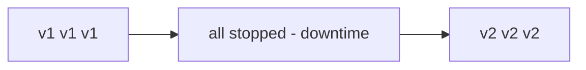

```yaml
spec:
  strategy:
    type: Recreate
```

**Use when:** the app cannot run two versions at once (e.g., incompatible DB schema), dev/test environments.

### 7.2 Rolling Update (default)

Replace Pods gradually, a few at a time.

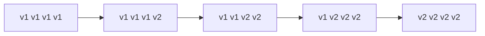

```yaml
spec:
  replicas: 4
  strategy:
    type: RollingUpdate
    rollingUpdate:
      maxSurge: 1          # extra Pods allowed above desired
      maxUnavailable: 0    # Pods allowed to be down
```

| Setting | Effect |
|---|---|
| `maxSurge: 1, maxUnavailable: 0` | Safest, always full capacity |
| `maxSurge: 0, maxUnavailable: 1` | No extra resources, slightly reduced capacity |
| `maxSurge: 25%, maxUnavailable: 25%` | Default |

Always define a **readinessProbe**, otherwise traffic may hit Pods that aren't ready.

### 7.3 Blue/Green

Run two full environments. Switch traffic by changing the Service selector.

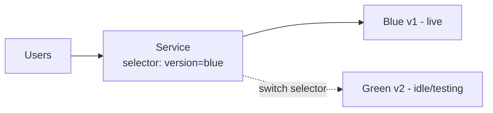

```yaml
# blue.yaml
apiVersion: apps/v1
kind: Deployment
metadata:
  name: app-blue
spec:
  replicas: 3
  selector:
    matchLabels: {app: myapp, version: blue}
  template:
    metadata:
      labels: {app: myapp, version: blue}
    spec:
      containers:
        - name: app
          image: myapp:1.0
---
# green.yaml
apiVersion: apps/v1
kind: Deployment
metadata:
  name: app-green
spec:
  replicas: 3
  selector:
    matchLabels: {app: myapp, version: green}
  template:
    metadata:
      labels: {app: myapp, version: green}
    spec:
      containers:
        - name: app
          image: myapp:2.0
---
# service.yaml
apiVersion: v1
kind: Service
metadata:
  name: myapp
spec:
  selector:
    app: myapp
    version: blue        # change to green to cut over
  ports:
    - port: 80
      targetPort: 8080
```

Cut over and roll back:

```bash
kubectl patch svc myapp -p '{"spec":{"selector":{"app":"myapp","version":"green"}}}'
# rollback
kubectl patch svc myapp -p '{"spec":{"selector":{"app":"myapp","version":"blue"}}}'
```

**Pros:** instant switch and rollback. **Cons:** double the resources.

### 7.4 Canary

Send a **small percentage** of traffic to the new version, increase if healthy.

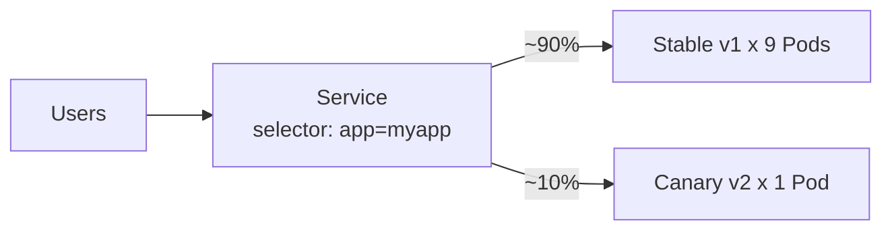

Simple replica-ratio canary (both Deployments share the label `app: myapp`):

```yaml
# stable: 9 replicas
metadata: {name: app-stable}
spec:
  replicas: 9
  selector: {matchLabels: {app: myapp, track: stable}}
  template:
    metadata: {labels: {app: myapp, track: stable}}
    spec: {containers: [{name: app, image: myapp:1.0}]}
---
# canary: 1 replica
metadata: {name: app-canary}
spec:
  replicas: 1
  selector: {matchLabels: {app: myapp, track: canary}}
  template:
    metadata: {labels: {app: myapp, track: canary}}
    spec: {containers: [{name: app, image: myapp:2.0}]}
---
# Service selects only app=myapp, so it matches both
apiVersion: v1
kind: Service
metadata: {name: myapp}
spec:
  selector: {app: myapp}
  ports: [{port: 80, targetPort: 8080}]
```

Promote: scale canary up, stable down. For precise percentages (e.g., exactly 5%) use an Ingress controller (NGINX canary annotations), a service mesh (Istio, Linkerd), or Argo Rollouts / Flagger.

### 7.5 A/B Testing

Like canary, but routing is based on **request attributes** (header, cookie, geography, user group) instead of random percentage. Used to compare business outcomes between versions. Needs an Ingress or service mesh.

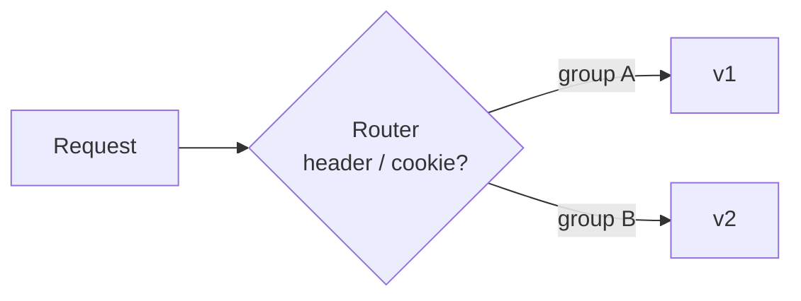

### 7.6 Shadow (Mirror)

Copy live traffic to the new version. Responses from the shadow are **discarded**. Safe way to test with real load. Needs a service mesh or proxy.

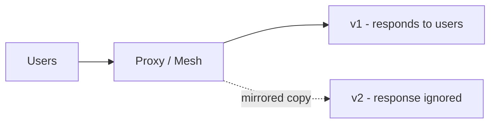

---

## 8. Choosing the Right Controller

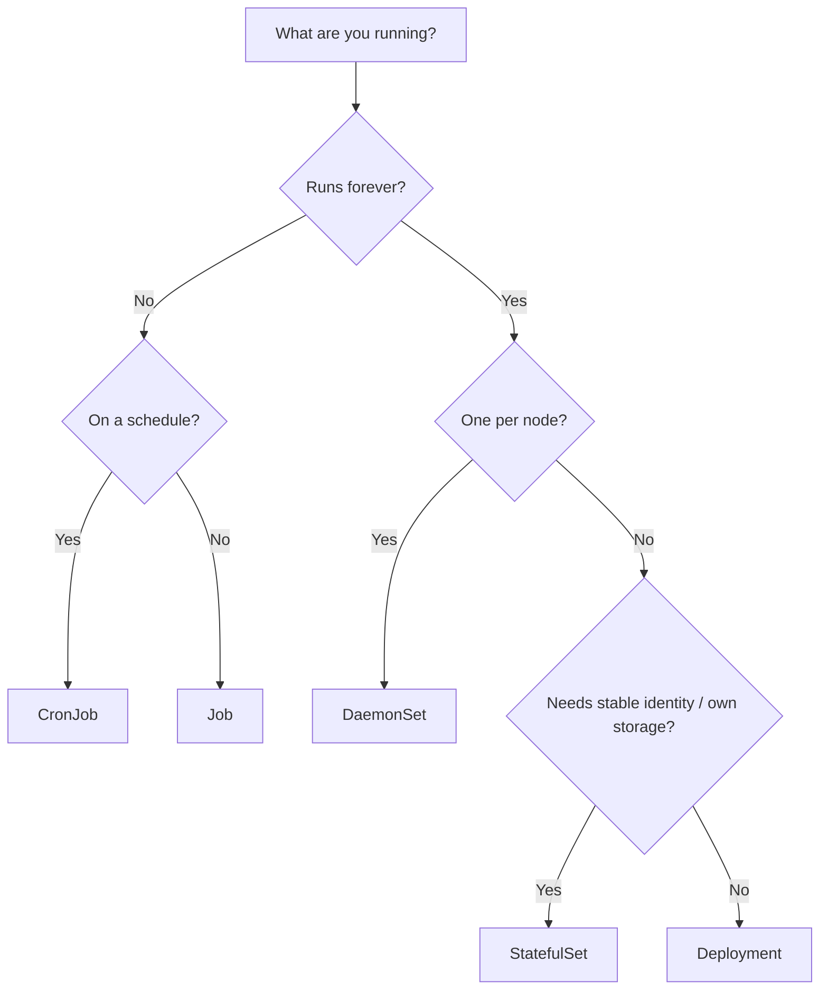

## 9. Choosing the Right Strategy

| Situation | Strategy |
|---|---|
| Dev/test, downtime acceptable | Recreate |
| Normal production release | Rolling Update |
| Need instant rollback, can afford 2x resources | Blue/Green |
| Risky change, want gradual exposure | Canary |
| Compare features by user group | A/B Testing |
| Validate under real traffic with zero risk | Shadow |

---

## 10. Quick Reference

```bash
# Deployment
kubectl rollout status|history|undo deploy/<name>
kubectl rollout pause|resume deploy/<name>

# DaemonSet / StatefulSet
kubectl get ds
kubectl get sts,pvc
kubectl rollout status sts/<name>

# Job / CronJob
kubectl get jobs,cronjobs
kubectl create job manual-run --from=cronjob/db-backup
kubectl patch cronjob db-backup -p '{"spec":{"suspend":true}}'
```
