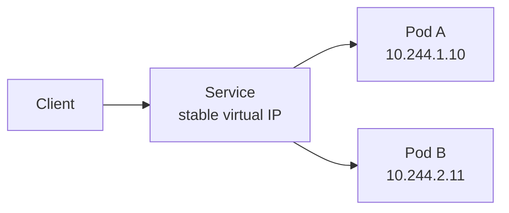
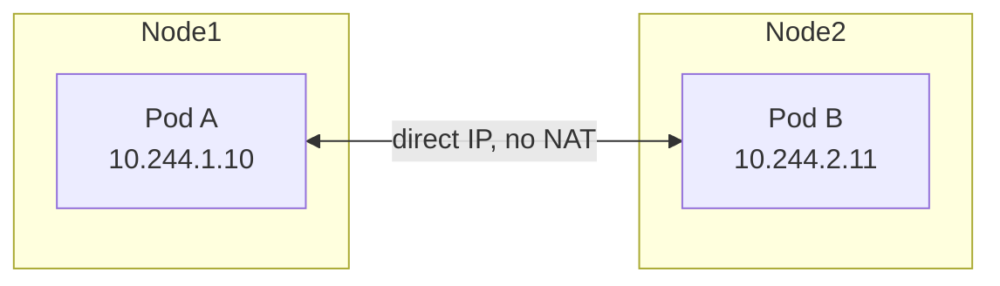
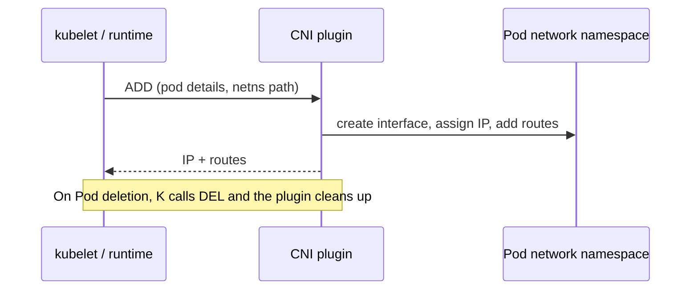
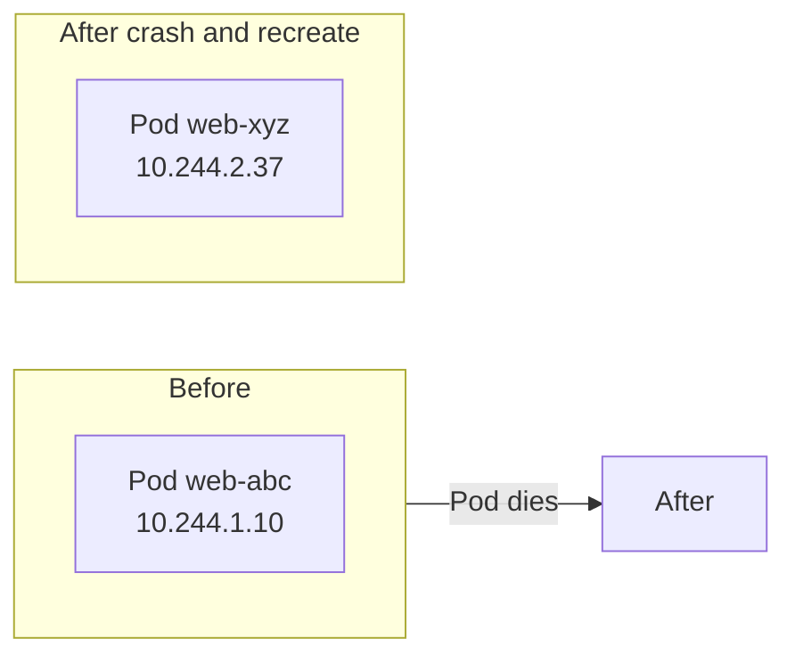
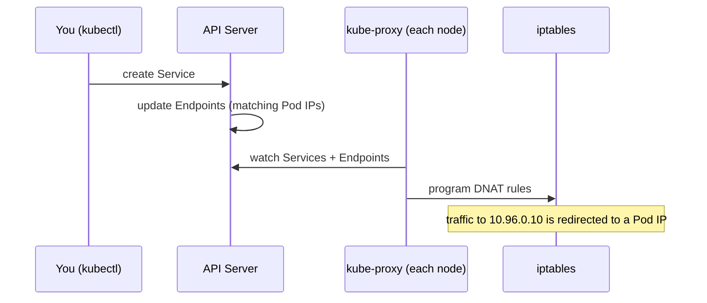
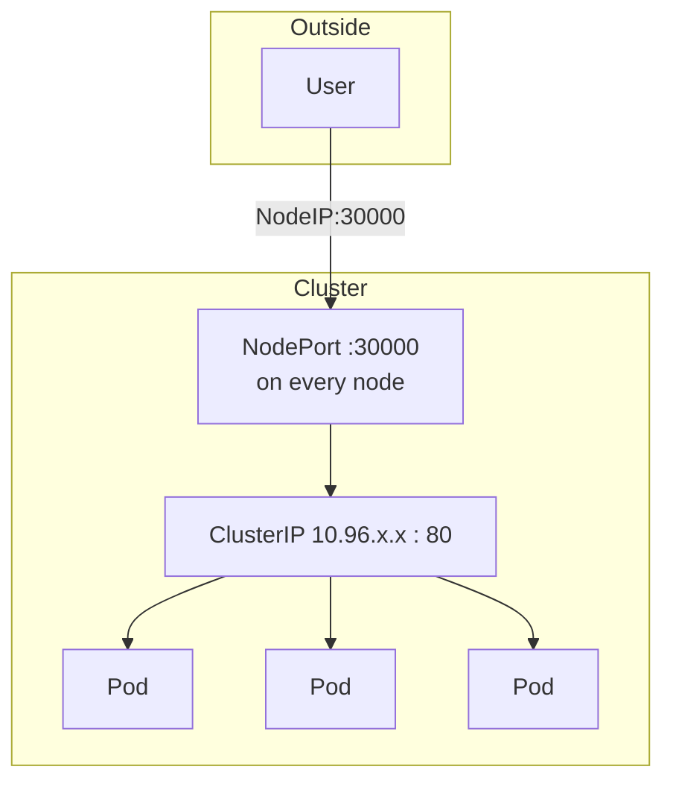
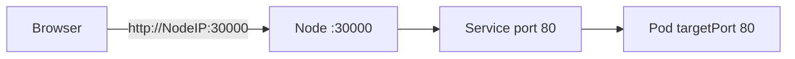
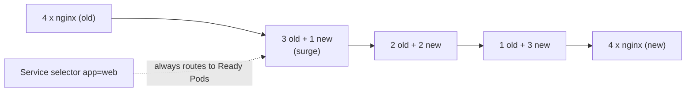

## Networking in Kubernetes: Pod networking, CNI, Services, kube-proxy, and Service types

---

## Summary (TL;DR)

| Concept | One-line meaning |
|---|---|
| Golden rule | Every Pod can reach every other Pod by IP, without NAT |
| CNI | Plugin spec that actually builds Pod networking; Kubernetes delegates to it |
| Pod IP | Real but temporary. Never depend on it |
| Service | Stable virtual IP (ClusterIP) + load balancing across matching Pods |
| kube-proxy | Node agent that programs iptables rules so Service IPs reach Pods |
| Service types | ClusterIP, NodePort, LoadBalancer, ExternalName |



---

## 1. The Golden Rule of Kubernetes Networking

> **Every Pod can talk to every other Pod using its IP, without NAT.**

Every Pod:

- has its **own IP**
- is **routable**
- is **isolated via network namespaces**

**Analogy:** think of Pods as people in one big office building where everyone has a direct phone extension. Nobody has to dial through a receptionist (NAT) to reach a colleague, even on a different floor (node).



---

## 2. CNI: Container Network Interface

Kubernetes **does not implement** Pod networking itself. It **delegates to CNI**.

- CNI = a **specification** + **execution plugins**
- Examples of plugins: Calico, Flannel, Cilium, Weave, AWS VPC CNI, Azure CNI

### How Kubernetes calls the plugin

Kubernetes (via the container runtime) calls the CNI plugin with:

| Input | Meaning |
|---|---|
| Pod details | Name, namespace, etc. |
| Network namespace path | Where to wire up the network |
| Action | `ADD` (Pod created) or `DEL` (Pod deleted) |

The CNI plugin then:

1. Sets up the networking (interface, routes, bridge or overlay)
2. **Returns the IP + routes**



---

## 3. Never Depend on Pod IPs

- Pods are **ephemeral**: they die and get recreated
- On recreation the **IP changes**

**Analogy:** a Pod IP is like a hotel room number for a guest. When the guest checks out and a new one arrives, the room can differ. You want a **fixed phone number for the hotel desk** (a Service), not the room number.



**Fix:** use a **Service** + **kube-proxy** to give clients a stable endpoint.

---

## 4. Service and kube-proxy

### What a Service provides

- A **stable virtual IP** (ClusterIP)
- **Load balancing** (Layer 4) to backend Pods

```text
Service IP: 10.96.0.10
Backends:
  Pod A: 10.244.1.10
  Pod B: 10.244.2.11
```

### kube-proxy

- Runs on **every node**
- Makes Services work by **programming traffic rules** (iptables)

### What happens when you create a Service

1. Kubernetes **updates the Endpoints** (the list of matching Pod IPs, selected by labels)
2. **kube-proxy** on each node:
    - watches Services and Endpoints
    - programs rules using **iptables**
3. Traffic sent to the Service IP is **redirected to one of the Pods**



> The Service IP is **virtual**: no interface owns it. It exists only as iptables rules on each node.

---

## 5. Hands-on: ReplicaSet

A ReplicaSet creates 4 Pods, each with a **unique IP**.

```yaml
---
apiVersion: apps/v1
kind: ReplicaSet
metadata:
  name: example-1
  labels:
    purpose: learning
spec:
  replicas: 4
  minReadySeconds: 2
  selector:
    matchLabels:
      app: web
  template:
    metadata:
      labels:
        app: web
        env: dev
    spec:
      containers:
        - name: nginx
          image: nginx:1.14.2
          resources:
            limits:
              memory: "128Mi"
              cpu: "500m"
          ports:
            - containerPort: 80
```

### Worked example: observe Pod IPs

```bash
kubectl apply -f replicaset.yaml
kubectl get pods -l app=web -o wide
```

Expected output (IPs will differ):

```text
NAME              READY   STATUS    IP            NODE
example-1-4k2xq   1/1     Running   10.244.1.10   node-1
example-1-9fh7d   1/1     Running   10.244.2.11   node-2
example-1-m8zrt   1/1     Running   10.244.1.12   node-1
example-1-x2pqw   1/1     Running   10.244.2.13   node-2
```

Delete one Pod and watch it come back with a **different IP**:

```bash
kubectl delete pod example-1-4k2xq
kubectl get pods -l app=web -o wide
```

This is exactly why we need a Service.

---

## 6. Service Types

A Service gives a **unique, stable IP** and **Layer 4 load balancing** across Pods. It can also be exposed **outside** the cluster.

| Type | Reachable from | How it works | Typical use |
|---|---|---|---|
| **ClusterIP** | Inside cluster only | Virtual IP, default type | Internal microservice calls |
| **NodePort** | Outside, via `<NodeIP>:<nodePort>` | Opens the same port on every node (default range 30000-32767) | Quick testing, labs |
| **LoadBalancer** | Outside, via cloud LB | Cloud provider provisions an external LB | Production internet-facing apps |
| **ExternalName** | Inside cluster | Returns a DNS CNAME record, no proxying | Point to an external service by name |



> Types build on each other: **LoadBalancer ⊃ NodePort ⊃ ClusterIP**.

API reference: https://kubernetes.io/docs/reference/generated/kubernetes-api/v1.34/#service-v1-core

### 6.1 ClusterIP Service

```yaml
---
apiVersion: v1
kind: Service
metadata:
  name: ex1-svc
spec:
  type: ClusterIP
  selector:
    app: web
  ports:
    - name: web
      port: 80
      targetPort: 80
      protocol: TCP
```

| Field | Meaning |
|---|---|
| `selector` | Picks Pods with label `app: web` |
| `port` | Port the **Service** listens on |
| `targetPort` | Port on the **Pod container** |
| `protocol` | TCP (default) |

Test it from inside the cluster:

```bash
kubectl get svc ex1-svc
kubectl get endpoints ex1-svc
kubectl run tmp --rm -it --image=busybox -- wget -qO- http://ex1-svc
```

### 6.2 NodePort Service

```yaml
---
apiVersion: v1
kind: Service
metadata:
  name: ex1-svc-external
spec:
  type: NodePort
  selector:
    app: web
  ports:
    - name: web
      port: 80
      targetPort: 80
      protocol: TCP
      nodePort: 30000
```

Traffic path:



Test:

```bash
curl http://<node-ip>:30000
```

---

## 7. Exercise

**Task:**

1. Create a Service that maps to a label in your Deployment and perform a **rolling update**.
2. While the rollout is happening, access the app via the **NodePort** Service and confirm it stays available.

### Solution manifest

```yaml
---
apiVersion: apps/v1
kind: Deployment
metadata:
  name: example-2
  labels:
    app: web
  annotations:
    kubernetes.io/change-cause: "nginx"
spec:
  minReadySeconds: 5
  replicas: 4
  revisionHistoryLimit: 10
  selector:
    matchLabels:
      app: web
  strategy:
    type: RollingUpdate
    rollingUpdate:
      maxSurge: 25%
      maxUnavailable: 25%
  template:
    metadata:
      labels:
        app: web
        env: dev
    spec:
      containers:
        - name: web
          image: nginx
          ports:
            - containerPort: 80
---
apiVersion: v1
kind: Service
metadata:
  name: ex2-svc-external
spec:
  type: NodePort
  selector:
    app: web
  ports:
    - name: web
      port: 80
      targetPort: 80
      protocol: TCP
      nodePort: 30000
```

### Key settings explained

| Setting | Value | Effect |
|---|---|---|
| `replicas` | 4 | Four Pods desired |
| `minReadySeconds` | 5 | A new Pod must stay Ready 5s before counting as available |
| `maxSurge` | 25% | Up to 1 extra Pod (4 x 25%) during update |
| `maxUnavailable` | 25% | Up to 1 Pod may be unavailable during update |
| `revisionHistoryLimit` | 10 | Keep 10 old ReplicaSets for rollback |
| `change-cause` annotation | "nginx" | Text shown in `kubectl rollout history` |

### Step-by-step

**Step 1.** Apply and verify:

```bash
kubectl apply -f exercise.yaml
kubectl get deploy,rs,pods,svc -o wide
curl http://<node-ip>:30000
```

**Step 2.** In a **second terminal**, run a continuous check:

```bash
while true; do curl -s -o /dev/null -w "%{http_code}\n" http://<node-ip>:30000; sleep 0.5; done
```

**Step 3.** In the first terminal, trigger a rolling update:

```bash
kubectl set image deployment/example-2 web=nginx:1.27
kubectl annotate deployment/example-2 kubernetes.io/change-cause="upgrade to nginx 1.27" --overwrite
kubectl rollout status deployment/example-2
```

**Step 4.** Observe:

- The loop keeps printing `200`, so the app stays available
- `kubectl get pods -w` shows old Pods terminating and new ones starting
- The Service keeps the **same IP and nodePort**; only the **Endpoints** change

**Step 5.** Check history and rollback:

```bash
kubectl rollout history deployment/example-2
kubectl rollout undo deployment/example-2
```

### What happens during the update



The Service selects by label `app: web`, which is the same in old and new Pods. As new Pods become Ready they are added to the Endpoints, and terminating Pods are removed. That is why traffic keeps flowing.

---

## 8. Troubleshooting Cheatsheet

| Symptom | Check |
|---|---|
| Service has no endpoints | `kubectl get endpoints <svc>`: do selector and Pod labels match? |
| Can't reach NodePort | Node firewall / security group allows port 30000? Right node IP? |
| Connection refused | `targetPort` matches the container's listening port? |
| Intermittent failures during rollout | Missing `readinessProbe`, so traffic hits Pods that aren't ready |
| Pod IP changed after restart | Expected. Use the Service, not the Pod IP |

---

## 9. Quick Revision Questions

1. What is the golden rule of Kubernetes networking?
2. Who actually sets up Pod networking: Kubernetes or CNI?
3. What three inputs does Kubernetes pass to a CNI plugin?
4. Why should you never hard-code a Pod IP?
5. What does kube-proxy do, and where does it run?
6. Name the four Service types. Which is internal only?
7. Difference between `port`, `targetPort`, and `nodePort`?
8. During a rolling update, why does the Service keep working?

<details>
<summary>Answers</summary>

1. Every Pod can reach every other Pod by IP without NAT.
2. CNI (Kubernetes delegates to it).
3. Pod details, network namespace path, action (ADD/DEL).
4. Pods are ephemeral; their IPs change on recreation.
5. Programs iptables rules from Services and Endpoints; runs on every node.
6. ClusterIP (internal), NodePort, LoadBalancer, ExternalName.
7. `port` is the Service's port; `targetPort` is the container's port; `nodePort` is the port opened on every node.
8. It selects Pods by label and only routes to Ready Pods; Endpoints update as Pods come and go.

</details>
